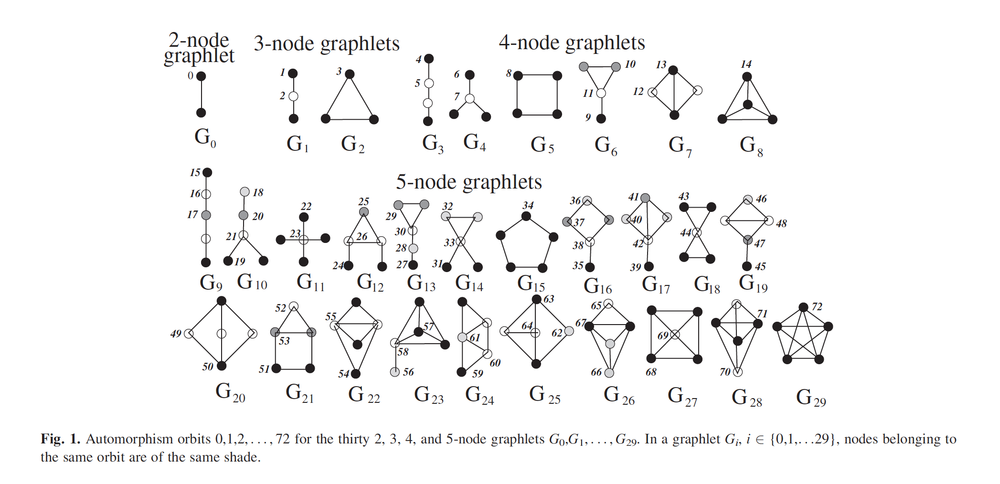

```{r setup, include=FALSE}
knitr::opts_chunk$set(echo = TRUE)
```

## Abstract

Comparing complex networks is a recurring problem across disciplines, yet many existing approaches emphasize discrimination over explanation. While global statistics and spectral distances can separate networks effectively, they often provide limited insight into how local structural organization gives rise to observed similarities or differences. In this work, we discuss Revealing the Hidden Language of Complex Networks and present a focused conceptual analysis of Graphlet Correlation Distance (GCD) as a framework for interpretable network comparison. Rather than representing networks through isolated summary features or raw subgraph counts, GCD characterizes networks by the dependency structure among node-level structural descriptors, yielding a compact representation of how local roles are organized across the system. We clarify the role-based perspective underlying graphlet correlations, discuss the impact of eliminating redundant structural information, and motivate the reduced formulation GCD-11 as a practical and expressive network signature. Finally, we assess the scope and limitations of the approach and outline the types of comparative questions it enables, particularly in settings where robustness and interpretability are central. Taken together, the analysis highlights GCD as a methodological shift toward comparing networks through structured relationships among local roles rather than through aggregated or opaque measures.


# 1. Introduction

## 1.1 General structure of Complex networks & comparison

Complex networks are a common representation for systems in which many interacting components give rise to collective behavior. Such representations appear across a wide range of domains, including molecular interaction networks, social and communication systems, transportation infrastructures, and economic trade networks. While the network abstraction provides a unifying mathematical language, the scientific questions that follow are often comparative in nature: whether two networks reflect similar organizing principles, whether a system has undergone a meaningful structural change, or whether a model network faithfully reproduces the structure of empirical data. Addressing these questions requires methods that can compare networks in a way that is both structurally sensitive and scientifically interpretable.

## 1.2 Why comparison of Complex Networks are hard

Network data shows up everywhere now. We map proteins that bind to proteins, airports connected by flights, firms trading with one another, users interacting on platforms, pages linked on the web, neurons firing in circuits. The natural next step, once a system is represented as a network, is comparison. We want to know whether two networks come from the same kind of process, whether a network has changed in a meaningful way over time, whether a model network really resembles the system it claims to reproduce, or whether two domains share deeper organizational similarities.

Yet network comparison remains surprisingly fragile. Part of the difficulty is that the objects we compare are not simple. Networks are large, noisy, and heterogeneous. Many are incomplete and assembled through measurement pipelines that introduce their own biases. Even when the data are clean, the structure we care about is rarely captured by a single global feature. Two networks can share the same average degree and still be organized in completely different ways. They can have similar clustering and still differ in how triangles are positioned and combined with other patterns. They can have similar degree distributions and still allocate influence, brokerage, or modularity differently across the system.

The core argument of Yaveroglu and coauthors is that comparison should aim for something stronger than a number that separates graphs. It should help us read topology as a kind of language. The language metaphor is not decorative. It signals a shift in what we expect from a network similarity measure. If a method works well, it should not only cluster networks correctly; it should give a structural explanation that a domain expert can recognize and debate. In other words, network comparison should be both discriminative and interpretable. This paper takes that goal seriously and uses Revealing the Hidden Language of Complex Networks as the central reference point. The main claim is that Graphlet Correlation Distance, and especially its practical form GCD 11, is not just another improvement over earlier metrics. It changes what we treat as meaningful evidence of similarity. Instead of comparing networks through isolated summary statistics or through raw subgraph frequencies, it compares the relationships between local structural roles inside a network. That difference is what turns topology into something closer to an interpretable signature.

## 1.2.1 Why full graph comparison is not the answer 

It is tempting to think that the best comparison is a complete one: take two graphs and quantify all structural differences. In practice this idea runs into a wall. Exact graph comparison quickly leads to computational problems that become infeasible as graphs grow. If one tries to match substructures across graphs in a direct way, subgraph isomorphism appears in the background, and this is not a problem that scales gracefully. 

## 1.2.1.1 Computational Intractability of Subgraph Isomorphism

The subgraph isomorphism problem is difficult to compute because it asks whether a smaller graph can be found inside a larger graph with the same pattern of connection, this means searching over all possible mappings between the vertices of two graphs, using a injective mapping function while preserving adjacentcy between vertices.

Let us assume that we work with two graphs \(G=(V_G,E_G)\) and \(H=(V_H,E_H)\), where \(|V_H|\le |V_G|\).

An injective mapping \(f:V_H\to V_G\) assigns each vertex of \(H\) to a distinct vertex of \(G\), while preserving adjacency of vertices.

\begin{equation}\label{eq:adjacency}
(u,v)\in E_H \;\Rightarrow\; (f(u),f(v))\in E_G.
\end{equation}

**Why does this become infeasible?**  

The computational hardness of subgraph isomorphism occures because we have to consider all the possible injective mappings between the vertices of the two graphs.

Let \(n = |V_G|\) and \(k = |V_H|\). 
The number of ways to choose and assign \(k\) distinct vertices of \(G\) to the \(k\) vertices of \(H\) is
\begin{equation}
n \cdot (n-1) \cdot (n-2) \cdots (n-k+1)
\;=\;
\frac{n!}{(n-k)!}.
\tag{2}
\end{equation}
which increases very rapidly as \(n\) grows.

After we have found the number of injective mappings \(V_H \rightarrow V_G\), we must check every possible mapping to see, whether they preserve the adjacency. Checking whether a single mapping preserves adjacency requires verifying the edge condition for all edges of \(H\), which takes time proportional to \(|E_H|\). Checking this accross all possible injective mappings leads to a total runtime on the order of
\[
\mathcal{O}\!\left(\frac{n!}{(n-k)!}\cdot |E_H|\right),
\]
which grows very quickly as \(n\) increases and becomes infeasible even for moderate values of \(k\).

## 1.2.2 What is a good network measure according to the paper

Even deciding whether a specific pattern exists inside a graph can be expensive. This is one of the reasons the literature has introduced approximations: summaries, distances based on a limited set of statistics, or comparisons through model fitting. The consequence is important. Since we cannot compare everything, we must decide what is worth comparing. A good network measure is therefore an answer to a deeper question: what aspects of structure are stable, informative, and meaningful under realistic constraints? The paper will argue that local structure, when treated in the right way, provides that foundation. It is rich enough to discriminate between networks, but also structured enough to be interpreted, because local patterns can be read as roles that nodes occupy in the system.

## 1.2.3 Global Statistics

The most common approach to comparison is still based on global statistics such as degree distribution, clustering coefficient, average path length, diameter, assortativity, or centrality summaries. These measures are valuable because they are easy to compute and often correlate with broad categories of behavior. But they struggle precisely where network comparison becomes scientifically interesting.

## 1.2.3.1 Degree Distribution

The degree of a node gives us, how many connections it does with other nodes. For a graph \(G = (V, E)\), the degree of a node \(v \in V\) is denoted by \(k_v\).
The degree distribution \(P(k)\) define the fraction of nodes in the graph that have degree \(k\),

\[
P(k) = \frac{|\{v \in V : k_v = k\}|}{|V|}.
\]

It provides a coarse summary of how connectivity is distributed across the network but ignores how vertices of different degrees are connected to each other.

## 1.2.3.2 Clustering Coefficient

The clustering coefficient tries to measure the tendency of nodes to form triangles.It also means how likely it is that a node’s neighbors are also connected to each other.
For a vertex \(v\) with degree \(k_v \ge 2\), its local clustering coefficient is defined as
\[
C_v = \frac{2T_v}{k_v (k_v - 1)},
\]
where \(T_v\) is the number of triangles that include vertex \(v\).

The global clustering coefficient is obtained by averaging \(C_v\) over all vertices.
This measure captures local tapology in a way but does not give insights about larger structural organization of a network.

## 1.2.3.3 Average Path Length

The average path length quantifies the distance between vertices on average.
Let \(d(u,v)\) denote the length of the shortest path between vertices \(u\) and \(v\).
The average path length is defined as
\[
L = \frac{1}{|V|(|V|-1)} \sum_{u \neq v} d(u,v).
\]
It shows the overall compactness of the network but it is still insensitive to local structural patterns that plays important role within a network.

## 1.2.3.4 Diameter

The diameter of a graph shows the maximum shortest-path between any pair of vertices,
\[
D = \max_{u,v \in V} d(u,v).
\]
It characterizes the largest scale of the network but depends only on extreme cases and ignores most of the network structure.

## 1.2.3.5 Assortativity

Assortativity measures the tendency of vertices to connect to other vertices with similar properties, most commonly degree.
Degree assortativity is defined as the Pearson correlation coefficient of the degrees at either end of an edge,
\[
r = \frac{\sum_{(u,v)\in E} (k_u - \mu)(k_v - \mu)}{\sum_{(u,v)\in E} (k_u - \mu)^2},
\]
where \(\mu\) is the mean degree over edge endpoints.
Positive assortativity indicates preference for similar-degree connections, while negative assortativity indicates disassortative mixing.


## 1.2.3.6 Centrality measures

Centrality measures aim to quantify the importance of individual vertices within a network.
Examples include degree centrality \(k_v\), betweenness centrality, and eigenvector centrality.
For instance, degree centrality is simply defined as
\[
C_{\text{deg}}(v) = k_v.

\]
While centrality measures identify influential vertices, aggregating them into global summaries often removes structural context.

## 1.2.4 Limitations of Global Statistics

There are limitations to global statistics. First, global summaries collapse heterogeneity. A degree distribution tells us how many high degree nodes exist, but not what those nodes do in context. Two networks can both contain hubs, yet in one network hubs may be tightly interconnected, while in another they may be separated and act as bridges between otherwise sparse regions. Clustering captures triangle density, but triangles can appear as isolated pockets, as parts of dense cores, or as local reinforcements around hubs, and these scenarios can have very different implications. Second, global statistics are often sensitive to data collection. In biological networks, for example, missing edges or experimental biases can change global measures substantially. When the measurement process differs across datasets, similarity in global statistics can become misleading and differences can become hard to interpret. This is not only a technical nuisance; it can undermine the scientific claim that two networks reflect different organizing principles. Third, global statistics rarely provide a compelling explanation when a comparison succeeds or fails. Suppose a method says that a protein interaction network is closer to a social network than to another biological network. If that decision is driven by a few global numbers, it is difficult to translate into a mechanistic or functional narrative. At best one can say that both networks have heavy tailed degrees or similar clustering. That does not tell us what kind of local organization is shared, nor how nodes are arranged into roles.

Yaveroglu and coauthors treat this as a conceptual limitation. A global statistic is not wrong, but it is blunt. It tends to describe a network as if it were uniform, when real networks are often built out of diverse local environments and repeated structural motifs. If we want comparison to have explanatory power, we need a representation that preserves the texture of local structure.

## 1.2.5 Spectral methods: powerful signals, weak explanations

Spectral distances are often presented as a more refined alternative to simple statistics. The eigenvalues of adjacency or Laplacian matrices capture aspects of connectivity that are not visible to single numbers such as average clustering. In many contexts, spectral features can separate graph families effectively. The problem is not performance alone. The problem is interpretation. A spectral difference can be hard to map back to a concrete structural statement. When two spectra differ, what does that mean in terms of roles, substructures, or organizational logic? There are cases where spectral theory provides insight, but in applied network science, the translation from eigenvalues to domain meaning is usually indirect.

The paper emphasizes this gap. If the goal is to reveal a hidden language, then it is not enough to have a distance that works; one needs a distance that speaks. Spectral distances can be excellent at detecting difference while remaining quiet about why that difference exists. That makes them less suitable as a general tool for scientific comparison where explanation is part of validation.

## 1.3 Local structure as a foundation for meaningful comparison

After seeing why comparing complex networks are hard and also the limitations above. A natural response would be to move from global summaries to local patterns. Local structure can capture the building blocks from which networks are assembled. This idea appears in several strands of network science, including the motif literature and the graphlet literature.

## 1.3.1 Motifs

Motifs, introduced prominently by Milo and colleagues, focus on patterns that occur more frequently than expected under a chosen random null model. This framing is useful because it ties structure to significance and, potentially, to function. However, it also brings a dependency: conclusions can change with the null model. Two researchers may obtain different motif profiles from the same network if they use different randomization constraints. Moreover, motif methods are designed to highlight patterns that are overrepresented, which can be an advantage when the goal is to detect distinctive building blocks, but it can also discard information contained in patterns that are not statistically enriched yet still structurally important for roles and organization.

## 1.3.2 Graphlets

Graphlets, developed and popularized in network biology by Przulj and others, take a different path. Graphlets are small induced subgraphs considered without the need to label them as significant relative to a null model. The induced requirement matters because it fixes the local configuration among chosen nodes. Graphlets therefore provide a stable vocabulary for describing local topology. Instead of asking which patterns are surprising, we ask which patterns are present and how nodes participate in them. This is where the central paper makes its key move. It accepts graphlets as the local vocabulary but argues that comparing raw graphlet frequencies is still not enough. Counting how many times each graphlet appears tells us what local patterns exist, but it does not tell us how those patterns are arranged across the network and how they combine into structural roles. Two networks can have similar graphlet counts and still organize those graphlets in different ways, distributing them across different node types or combining them into different role relationships.
The paper proposes that to reveal the language, we must focus not only on which words appear, but on how they are used together.



